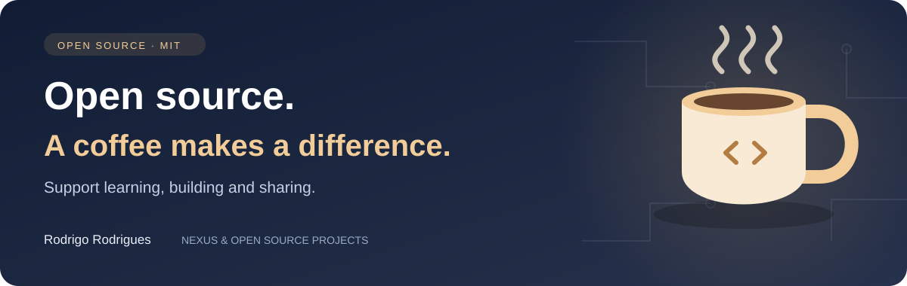

<p align="right">
  <a href="README.md"></a>
  <a href="README.en-US.md"></a>
  <a href="README.es-AR.md"></a>
</p>

# mascarar-segredos

Best-effort secret redaction for text, JSON and structured objects before logging.

## Start here

Version 1.2.0 also redacts URL userinfo, Basic authentication and complete
Authorization/Cookie/Set-Cookie header lines. Safe query parameters remain
available for diagnostics. The exported sensitive-key list is immutable.
This is not universal anonymization: personal data in unrecognized fields can
remain. Minimize collected data and test your application's log formats.

Run `node examples/uso.mjs` for synthetic examples. Input `toJSON` functions
are neutralized rather than executed while redacting or serializing.

Requires Git and Node.js 22+ for tests. No runtime dependencies. Download the actual repository rather than an unverified same-name npm package.

```sh
git clone https://github.com/Rdraim/mascarar-segredos.git
cd mascarar-segredos
npm test
node tools/check-public-content.mjs
```

These imports work from the cloned repository root. To use the module in another project, install a pinned Git tag (v1.2.1) or copy the module while retaining the MIT license. This documentation does not claim an npm registry release.

```js
import { mascararObjeto, mascararTexto, mascararJSON } from './src/index.js';
console.log(mascararObjeto({ usuario: 'example', senha: 'synthetic' }));
console.log(mascararTexto('password="synthetic example"'));
console.log(mascararJSON({ token: 'synthetic' }));
```

## API

`mascararTexto(texto)`; `mascararObjeto(obj)`; `mascararJSON(obj, espaco)`; `CHAVES_SENSIVEIS`.

Public function and option names remain in Portuguese for compatibility.

## Behavior and limits

Redacts sensitive key names and selected known value patterns, including cookies and CPF/CNPJ fields. Valid JSON text is reserialized; Maps/Sets become arrays, dates become ISO strings, getters are not executed, and cycles become `[circular]`. This is heuristic: it does not anonymize every personal identifier or detect every standalone secret. Prefer allowlisted log fields. Apply input-size limits before logging. BigInt requires application-specific serialization.

## Maintenance

These standalone modules are inspired by work on Nexus, Rodrigo Rodrigues's independent project. They contain no private database, deployment configuration, logs, credentials or user records. Coordinated maintenance means reviewing related changes in the same release cycle, not automatically copying private source files.

## Security and compatibility

Quoted values with spaces, cookies, shared references and accessor/prototype safety.

[Contributing](CONTRIBUTING.en-US.md) · [Security](SECURITY.en-US.md)

MIT © Rodrigo Rodrigues

---

<p align="center">
  
</p>

## ☕ Buy me a coffee

Did this project help you solve a problem, learn something new, or take your first steps in development? If you feel like supporting my work, a coffee is a kind way to say thank you.

I’m **Rodrigo Rodrigues**, creator of **Nexus** and these open source projects. Your support helps me set aside time to improve the code, write clearer examples, and keep sharing what I learn.

**Give any amount that feels right to you. Supporting is completely optional — the project remains free under the MIT license.**

<p>
  <a href="#support-via-pix"></a>
  <a href="https://github.com/Rdraim/mascarar-segredos/issues/new?title=Feedback%3A%20this%20project%20helped%20me"></a>
</p>

### Support via Pix

In your banking app, scan the QR code or copy the Pix key below. Choose your amount and check the recipient details before confirming.

<p align="center">
  
</p>

**Pix key**

```text
8875a24e-44d1-4c91-b6bb-62c9f0070955
```

Pix is Brazil’s payment system. If your bank does not support it, you can still help by sharing the project, reporting a bug, improving the documentation, or leaving feedback.

### Your feedback matters, too

[Tell me how the project helped you](https://github.com/Rdraim/mascarar-segredos/issues/new?title=Feedback%3A%20this%20project%20helped%20me). I’d love to hear what you built, what you learned, and what could be clearer for someone just starting out.

A comment is welcome with or without a donation. Please keep payment receipts, personal details, credentials and private user data out of public Issues.

---

**Thank you for supporting my work and helping me keep building and sharing. ❤️**
